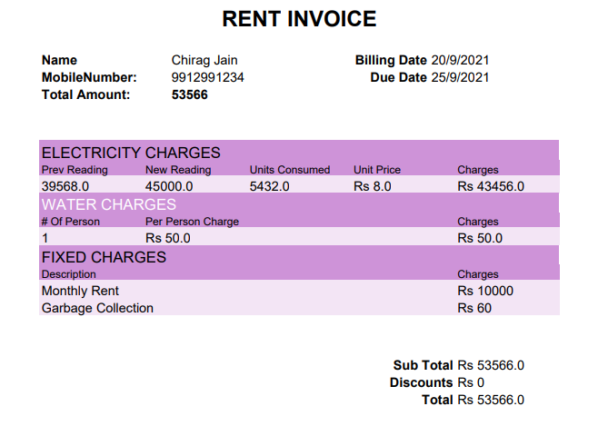

## End Products Version V1
- URL: https://rent-invoice.herokuapp.com/
- Video: https://youtu.be/78PTropCQ8c

## Rent Invoice V1 
- This is a project to automate the process of generation of rent invoice.
- In Version 1, the software provides a direct form which can be used to enter data and generate invoice
- This will provide a one stop destination for creating invoices.
- If you want to locate where output files are saved on server then u can check invoiceGenerator/invoice_outputs/

## What Will Come in Version 2 
In version 2 we will provide a complete login system for the landlords from which they can maintain all of their properties and generate invoice for all the tenants. It will also be able to fetch old records and help landlords in generating invoices quickly as they do not need to fill the previous bill values.For Example for electricity meters landlords need to fill the new reading and old reading in version 1, whereas in version 2 they do not need to worry about the old reading as it will be automatically fetched from database.
Apart from this landlords will also be able to send the rent receipts via email to all tenants in one click.

## Code FlowCharts

## Input/Output Screenshots
- Frontend Structure

- Filling Data into Frontend

- Result Obtained in PDF Invoice

## How to use the Project ? 
- Step1- Clone the repo 
- Step2- Create a additional Folder "RentInvoice_v1" and place the code inside this folder.
- Step3- Create a virutal environment (Command for windows user : virtualenv env )
- Step4- Activate the environment (Command for windows user : env/scripts/activate )
- Stept5- Install All The Dependancies using command- pip install -r requirements.txt
- Step6- Now make sure that your current working directory on terminal has all the code files. (Can be checked by seeing if manage.py file is present in current working directory)
- Step6- Execute to make pending migrations- python manage.py migrate 
- Step7- Execute to spin up the server- python manage.py runserver
